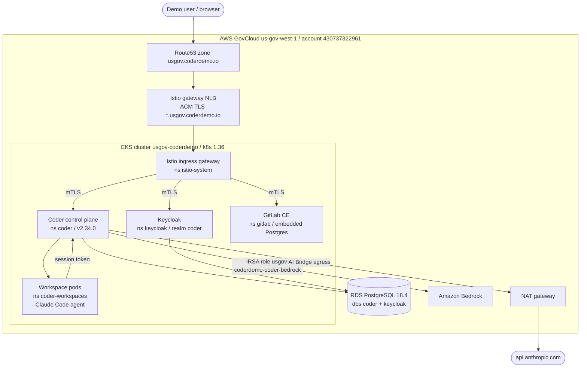

# As-built overview: Coder + AI demo on AWS GovCloud

Status source of truth: [`STATUS.md`](../../STATUS.md). This document describes
the environment **as it was actually built**, which differs in places from the
original target design in [`docs/architecture/`](../architecture/). Those
deviations are called out inline.

- Region / account: `us-gov-west-1`, account `430737322961`, partition
  `aws-us-gov`. Everything runs inside the GovCloud boundary.
- Domain: `usgov.coderdemo.io`.
- Coder version: `v2.34.0` (confirmed live via
  `GET https://dev.usgov.coderdemo.io/api/v2/buildinfo` -> `v2.34.0+3006da5`),
  licensed with the AI Governance add-on plus premium entitlements.

## What the demo proves

A self-contained, in-boundary developer platform where every authentication,
source-control, and AI path stays inside AWS GovCloud:

1. **Coder control plane** on EKS as the single governance and workspace plane
   (`deploy/coder/values.yaml`).
2. **Keycloak SSO** as the identity provider via OIDC (realm `coder`), so users
   sign in with "Sign in with Keycloak" instead of any external IdP
   (`deploy/coder/values.yaml`, `deploy/keycloak/realm-coder.json`).
3. **In-boundary GitLab** as the source-control manager, wired as a Coder git
   external-auth provider so workspace git operations use short-lived
   in-boundary OAuth tokens (`deploy/gitlab/`, `deploy/coder/values.yaml`).
4. **Coder AI Gateway (AI Bridge)** as the governed egress for model traffic,
   fronting two providers: `anthropic` (direct to `api.anthropic.com` over the
   NAT gateway) and `anthropic-bedrock` (Amazon Bedrock in-region via IRSA, no
   static keys).
5. **Coder Agents running Claude Code** in workspace pods, talking only to the
   AI Gateway with the owner's session token, never holding a raw model key
   (`coder-templates/claude-code/main.tf`).

The hardening posture removes external egress paths: Coder's built-in GitHub
login default provider is disabled, path-based workspace apps are disabled, and
the only model egress is the governed AI Gateway path.

> **Deviation from the target design.** The original architecture docs
> (`docs/architecture/overview.md`, `target-architecture.md`) placed GitLab on
> EC2, RDS on PostgreSQL 17 Multi-AZ, and reserved Istio, OpenShift, Grafana,
> and full identity sync for later phases. As built, GitLab runs **in-cluster**
> on EKS as a single-container StatefulSet with embedded Postgres, RDS is a
> **Multi-AZ PostgreSQL 18.4** instance (one shared instance backing both the
> `coder` and `keycloak` databases, on version 18.4 rather than 17), and
> OpenShift (OCP) remains **out of scope**. Istio, observability, and identity
> sync, originally deferred, have since been built; Istio is now the live L7
> edge with mesh-wide STRICT mTLS (`STATUS.md`; see
> [`25-istio-service-mesh.md`](25-istio-service-mesh.md)). The identity doc
> (`docs/architecture/identity.md`) names realm `usgov`; the realm that was
> actually imported and is in use is **`coder`** (`STATUS.md`,
> `deploy/CONVENTIONS.md`, `deploy/keycloak/README.md`).

## Component map

| Layer | Component | Where | Notes |
|---|---|---|---|
| Edge | Istio ingress gateway NLB + ACM cert `*.usgov.coderdemo.io` | ns `istio-system` | Live L7 edge. TLS terminates at the gateway NLB; the gateway forwards to meshed Services over mTLS (`25-istio-service-mesh.md`). |
| Edge | Route53 zone `Z06701704WFETYIRU5C8` | AWS | Alias A records `dev` / `auth` / `gitlab` / `grafana` / `kiali` / `*` -> the Istio gateway NLB (`25-istio-service-mesh.md`). |
| Mesh | Istio `1.30.1`, mesh-wide STRICT mTLS | ns `istio-system` | Sidecars injected in `coder`, `keycloak`, `gitlab`; `coder-workspaces` excluded (`25-istio-service-mesh.md`). |
| Ingress (retained) | ingress-nginx (Helm chart `4.15.1`) + aws-load-balancer-controller | ns `ingress-nginx` | Out of the DNS path; kept running for per-host rollback. Decommission tracked in issue #34. |
| Control plane | Coder `v2.34.0` (1 replica) | ns `coder` | OIDC SSO, AI Gateway, GitLab external auth, path apps disabled (`deploy/coder/values.yaml`). |
| Identity | Keycloak `26.6.3`, realm `coder` | ns `keycloak` | OIDC client `coder`; admin console `/admin` (`deploy/keycloak/`). |
| SCM | GitLab CE `19.0.1-ce.0`, embedded Postgres | ns `gitlab` | Single-container Omnibus StatefulSet `gitlab-0` (`deploy/gitlab/`). |
| Workspaces | Claude Code template pods | ns `coder-workspaces` | `enterprise-base` image, gp3 PVC, Claude Code + AgentAPI + code-server (`coder-templates/claude-code/main.tf`). |
| Data | RDS PostgreSQL `18.4`, single instance | AWS | Databases `coder` and `keycloak`; `rds.force_ssl=1` (`deploy/CONVENTIONS.md`, `STATUS.md`). |
| Registry | ECR `430737322961.dkr.ecr.us-gov-west-1.amazonaws.com` | AWS | Mirrored images, no pull-through in GovCloud (`scripts/mirror-images.sh`). |
| AI egress | AI Gateway -> `api.anthropic.com` via NAT; or Bedrock via IRSA | AWS | Provider `anthropic` (direct) and `anthropic-bedrock` (Bedrock). |

EKS detail: cluster `usgov-coderdemo`, k8s `1.36`, standard EKS (Auto Mode was
abandoned in this account), managed node group `mng` of 3x `m5.xlarge`
(`AL2023_x86_64_STANDARD`, static capacity). Provisioners are **internal only**:
3 built-in provisioner daemons run in the coderd pod, with no external daemons
(`STATUS.md`, facts sheet). See `20`/`10` companion docs below.

## Topology



ASCII summary for terminals:

```text
            Internet
               |
        Route53 (usgov.coderdemo.io)
               |
   Istio gateway NLB (ACM TLS *.usgov.coderdemo.io)
               |
       Istio ingress gateway (ns istio-system)
        /      |      \   (mTLS to meshed Services)
     Coder  Keycloak  GitLab        (all on EKS; GitLab embeds its own Postgres)
       |        |
       +--------+--> RDS PostgreSQL 18.4 (coder, keycloak dbs)
       |
       +--> coder SA -> Bedrock (IRSA, in-region, no static key)
       +--> AI Bridge -> NAT gateway -> api.anthropic.com
       |
       +--> workspace pods (coder-workspaces) -> back to Coder via session token
```

## Core flows

### A. User login / SSO via Keycloak OIDC

1. A user opens `https://dev.usgov.coderdemo.io` and chooses "Sign in with
   Keycloak" (button text from `CODER_OIDC_SIGN_IN_TEXT`).
2. Coder redirects to the Keycloak issuer
   `https://auth.usgov.coderdemo.io/realms/coder`, with client id `coder` and
   scopes `openid,profile,email` (`deploy/coder/values.yaml`).
3. Keycloak authenticates the user in realm `coder` and redirects back to
   `https://dev.usgov.coderdemo.io/api/v2/users/oidc/callback`
   (`deploy/keycloak/realm-coder.json`).
4. Coder validates the token server-side. The in-cluster NLB hairpin to the
   public `auth.` hostname presents valid TLS, so server-side OIDC works
   (`STATUS.md`, `deploy/platform/README.md`). Coder maps `email_field=email`
   and `username_field=preferred_username`, and `CODER_OIDC_ALLOW_SIGNUPS=true`
   lets a first-time SSO user self-provision.
5. **No group or role sync.** OIDC `group_field` is empty and the realm has no
   group-claim mapper, so login grants an account only; group and role mapping
   is a known gap (`STATUS.md`, facts sheet). The GitHub default login provider
   is disabled, so the only sign-in paths are Keycloak SSO and the local
   password owner (`deploy/coder/values.yaml`).

### B. Workspace create -> GitLab external auth -> agent ready

1. The user creates a workspace (or Coder Task) from the single template
   `claude-code`.
2. The template declares `data "coder_external_auth" "gitlab"` (id `gitlab`),
   so the dashboard surfaces a "Login with GitLab" control and the build blocks
   until the owner completes the in-boundary GitLab OAuth flow
   (`coder-templates/claude-code/main.tf`). Coder uses the GitLab endpoints
   `…/oauth/authorize`, `…/oauth/token`, and `…/oauth/token/info`
   (`deploy/coder/values.yaml`).
3. An in-process provisioner (one of the 3 built-in daemons in coderd) applies
   the template Terraform: it creates a gp3 PVC and a pod in
   `coder-workspaces`. The `coder-workspace-perms` Role/RoleBinding lets the
   `coder` service account manage pods and PVCs in that namespace
   (`deploy/platform/workspace-rbac.yaml`).
4. The pod boots the ECR-mirrored `enterprise-base` image and the agent connects
   using `CODER_AGENT_TOKEN` / `CODER_AGENT_URL`. The `claude-code` module
   installs Claude Code and AgentAPI; `code-server` is installed as an extra app
   (`coder-templates/claude-code/main.tf`).
5. The agent reports ready once external auth is satisfied. Its git credential
   helper then injects a short-lived GitLab OAuth token for clone / fetch / push
   to `gitlab.usgov.coderdemo.io`. No PATs or SSH keys live in the workspace
   (`STATUS.md`).

### C. Claude Code request -> AI Bridge -> provider

1. On the agent, the `claude-code` module sets
   `ANTHROPIC_BASE_URL=https://dev.usgov.coderdemo.io/api/v2/aibridge/anthropic`
   and `CLAUDE_API_KEY=<owner session token>`; the template also exports
   `ANTHROPIC_AUTH_TOKEN` (the same session token). No raw Anthropic key is
   placed in the workspace (`coder-templates/claude-code/main.tf`).
2. Claude Code POSTs to
   `…/api/v2/aibridge/anthropic/v1/messages` with the session token.
3. The AI Gateway authenticates the session, applies governance and audit (AI
   Governance add-on), routes by provider **name** `anthropic`, and forwards to
   that provider's base URL `https://api.anthropic.com`. Egress leaves the VPC
   through the single NAT gateway (`deploy/coder/values.yaml`, facts sheet).
4. The alternative provider `anthropic-bedrock` (type `bedrock`) calls Bedrock
   in-region using the coder service account IRSA role
   `usgov-coderdemo-coder-bedrock` (no static key), model
   `us-gov.anthropic.claude-sonnet-4-5-20250929-v1:0`, with small-fast model
   `amazon.nova-pro-v1:0` (`deploy/coder/values.yaml`).
5. **Current state.** The `anthropic` provider holds a **placeholder** key, so
   routing is verified end to end but returns `502 "all configured keys failed
   authentication"`. The remaining action is to paste a real `sk-ant-...` key
   into the `anthropic` provider at `/ai/settings` (UI, not the k8s secret).
   Bedrock Claude Sonnet 4.5 access is still gated; `amazon.nova-pro-v1:0` is
   the proven in-GovCloud fallback (`STATUS.md`, facts sheet).

## Detailed companion documents

The deep-dive as-built documents live in this directory, numbered by layer.
Confirmed filenames are linked. Companion docs that may still be in flight
(`10`, `20`, `60`, `70`, `80`) follow the same `NN-topic.md` convention;
confirm exact names against the directory listing if a link does not resolve.

| Doc | Topic |
|---|---|
| `10-*.md` | Infrastructure substrate (Terraform): VPC, RDS, ECR, IRSA OIDC provider + Bedrock role, EKS cluster. |
| `20-*.md` | EKS platform: standard node group `mng`, addons, gp3 storage, ingress / NLB / DNS, workspace RBAC. |
| [`25-istio-service-mesh.md`](25-istio-service-mesh.md) | Istio service mesh: the ingress gateway L7 edge (own NLB + ACM cert), mesh-wide STRICT mTLS, sidecar injection scope, the RDS ServiceEntry, and Kiali. |
| [`30-coder-control-plane.md`](30-coder-control-plane.md) | Coder Helm values, server env, hardening, licensing. |
| [`40-identity-keycloak.md`](40-identity-keycloak.md) | Keycloak realm `coder`, OIDC client, SSO config, identity gaps. |
| [`50-gitlab-scm.md`](50-gitlab-scm.md) | In-boundary GitLab and the Coder git external-auth provider. |
| `60-*.md` | AI Gateway / AI Bridge, DB-managed providers, Bedrock IRSA. |
| `70-*.md` | `claude-code` workspace template, Coder Agents, Tasks, code-server. |
| `80-*.md` | Additional layer (for example networking or security hardening); confirm topic in the directory. |
| [`90-operations-runbook.md`](90-operations-runbook.md) | Day-2 operations: access, upgrades, template push, image mirroring, known gaps. |

---

*As-built documentation authored by Coder Agents. Read-only; grounded in repo
files and `STATUS.md`.*
