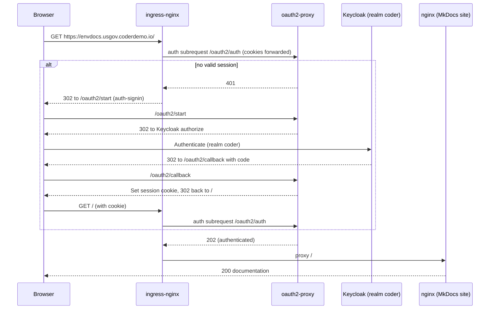

# Access and auth gate

This documentation site is published at `https://envdocs.usgov.coderdemo.io` and
gated so that **any authenticated user in the Keycloak realm `coder`** can read
it, with no group restriction. The gate is built from ingress-nginx
external-auth annotations and oauth2-proxy, fronting a static MkDocs site served
by nginx.

Source of truth: `deploy/envdocs/`, `scripts/setup-envdocs.py`.

## Why ingress-nginx for this host

The core stack (`dev`, `auth`, `gitlab`, `grafana`, `kiali`) resolves through
the Istio ingress gateway via the Route53 wildcard `*.usgov.coderdemo.io`.
ingress-nginx is retained but out of the DNS path. This site uses an explicit
Route53 alias `envdocs.usgov.coderdemo.io` to the ingress-nginx NLB. A more
specific record wins over the wildcard, so envdocs traffic flows through
ingress-nginx, where the `auth-url` / `auth-signin` external-auth annotations and
oauth2-proxy live. Both NLBs carry the same `*.usgov.coderdemo.io` ACM
certificate, so TLS is valid either way.

## Components (namespace `envdocs`)

| Component | Role |
|---|---|
| `envdocs` Deployment (nginx) | Serves the built static MkDocs site on port 80 |
| `oauth2-proxy` Deployment | OIDC auth gate against realm `coder`; auth-only (`upstream=static://200`) |
| `envdocs-oauth` ExternalSecret | Syncs `client-secret` and `cookie-secret` from ASM `usgov-coderdemo/envdocs/oauth` |
| Ingress `envdocs-oauth2` | Routes `/oauth2/*` to oauth2-proxy (start, callback, auth) |
| Ingress `envdocs` | Routes `/` to nginx with the external-auth annotations |

## Request flow



## The `envdocs` Keycloak OIDC client

`scripts/setup-envdocs.py` creates a confidential client `envdocs` in realm
`coder` (standard flow, PKCE S256), mirroring `scripts/setup-grafana-oidc.py`:

- Redirect URI: `https://envdocs.usgov.coderdemo.io/oauth2/callback`
- A full-path `groups` membership mapper is added for parity with the other realm
  clients, but it is **not** enforced (any authenticated realm user is allowed).

The client secret is published to AWS Secrets Manager at
`usgov-coderdemo/envdocs/oauth` alongside a generated oauth2-proxy
`cookie-secret`. The ExternalSecret `envdocs-oauth` syncs both into the
Kubernetes Secret `envdocs-oauth`. No secret is committed to git.

## oauth2-proxy configuration

Any authenticated realm user is allowed via `email_domains=*`. Key settings:

```text
OAUTH2_PROXY_PROVIDER          = oidc
OAUTH2_PROXY_OIDC_ISSUER_URL   = https://auth.usgov.coderdemo.io/realms/coder
OAUTH2_PROXY_CLIENT_ID         = envdocs
OAUTH2_PROXY_REDIRECT_URL      = https://envdocs.usgov.coderdemo.io/oauth2/callback
OAUTH2_PROXY_EMAIL_DOMAINS     = *
OAUTH2_PROXY_UPSTREAMS         = static://200
OAUTH2_PROXY_REVERSE_PROXY     = true
OAUTH2_PROXY_COOKIE_SECURE     = true
OAUTH2_PROXY_SKIP_PROVIDER_BUTTON = true
```

The client id is non-secret config; `OAUTH2_PROXY_CLIENT_SECRET` and
`OAUTH2_PROXY_COOKIE_SECRET` come from the `envdocs-oauth` Secret.

## How the site is built and served

The MkDocs sources (Markdown plus `mkdocs.yml`) are authored under
`docs/envdocs/` in the repository. They are shipped into the cluster as a
ConfigMap (`envdocs-site`) that `scripts/setup-envdocs.py` generates from
`docs/envdocs/`. The `envdocs` pod has two containers:

1. An init container (`squidfunk/mkdocs-material`, ECR-mirrored) runs
   `mkdocs build` from the ConfigMap sources into a shared volume. The Material
   theme bundles its own CSS/JS, so the built site is self-contained.
2. The nginx container serves that built site on port 80.

Mermaid diagrams render client-side. Material loads `mermaid.js` in the reader's
browser, so the reader needs ordinary internet access to the Mermaid CDN; the
server itself needs no extra egress.

## Images mirrored into ECR

`scripts/setup-envdocs.py` ensures these three images are mirrored into private
ECR (no pull-through cache in GovCloud), mirroring `scripts/mirror-images.sh`:

| Upstream | ECR path |
|---|---|
| `docker.io/library/nginx:1.27-alpine` | `docker-hub/library/nginx:1.27-alpine` |
| `docker.io/squidfunk/mkdocs-material:9.7.6` | `docker-hub/squidfunk/mkdocs-material:9.7.6` |
| `quay.io/oauth2-proxy/oauth2-proxy:v7.7.1` | `quay/oauth2-proxy/oauth2-proxy:v7.7.1` |
