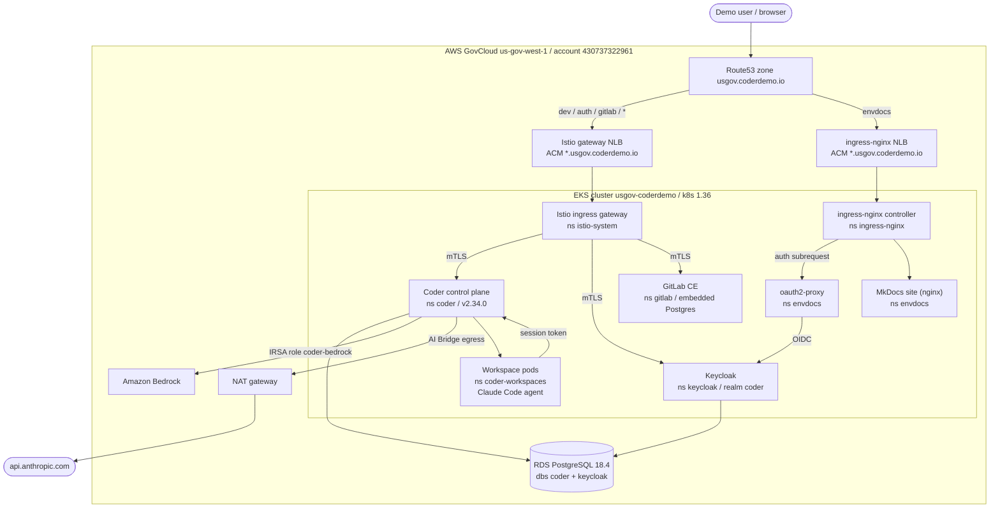
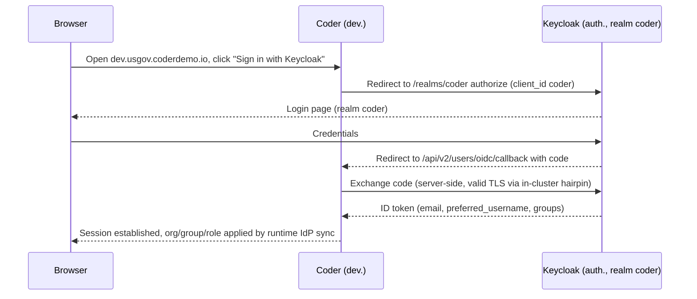
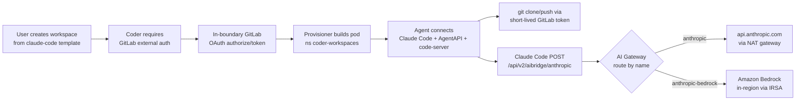

# Architecture

The environment runs entirely inside the AWS GovCloud boundary
(`us-gov-west-1`, account `430737322961`). Public traffic enters through
Route53, terminates TLS at an NLB with the `*.usgov.coderdemo.io` ACM
certificate, and reaches workloads on the EKS cluster `usgov-coderdemo`.

## Two ingress edges

There are two load balancers in front of the cluster, and DNS decides which one
a given host uses.

| Edge | NLB | Hosts in the DNS path |
|---|---|---|
| Istio ingress gateway | `k8s-istiosys-...elb.us-gov-west-1.amazonaws.com` | `dev`, `auth`, `gitlab`, `grafana`, `kiali`, registry, and the `*` wildcard |
| ingress-nginx | `k8s-ingressn-...elb.us-gov-west-1.amazonaws.com` | `envdocs` (this site) only, via an explicit Route53 alias |

The Route53 wildcard `*.usgov.coderdemo.io` aliases to the Istio gateway NLB, so
the core stack is served through Istio with mesh-wide STRICT mTLS. ingress-nginx
is retained as a per-host rollback path and is otherwise out of the DNS path.
This documentation site is the deliberate exception: an explicit
`envdocs.usgov.coderdemo.io` alias points at the ingress-nginx NLB (a more
specific record wins over the wildcard), because the auth gate for this site is
built from ingress-nginx external-auth annotations and oauth2-proxy. See
[Access and auth gate](access-and-auth.md).

## Topology



## Core flow A: SSO login to Coder



On login Coder runs three IdP sync passes (organization, group, role) keyed on a
single full-path `groups` claim, placing the user in the correct Coder
organization(s), groups, and roles with no manual assignment. See
[Identity (Keycloak)](identity-keycloak.md).

## Core flow B: workspace create, GitLab auth, agent, AI



The workspace agent never holds a raw model key. Claude Code authenticates to
the AI Gateway with the workspace owner's Coder session token, and the gateway
applies governance and audit before forwarding to the named provider. See
[AI Gateway](ai-gateway.md).

## ASCII summary

```text
            Internet
               |
        Route53 (usgov.coderdemo.io)
          /                       \
   Istio gateway NLB        ingress-nginx NLB
   (dev/auth/gitlab/*)      (envdocs only)
          |                       |
   Istio ingress gw         ingress-nginx
    /     |     \                 |
 Coder Keycloak GitLab      oauth2-proxy -> Keycloak (OIDC)
    |      |                      |
    +------+--> RDS 18.4     MkDocs site (nginx)
    |
    +--> coder SA -> Bedrock (IRSA, in-region, no static key)
    +--> AI Bridge -> NAT gateway -> api.anthropic.com
    |
    +--> workspace pods (coder-workspaces) -> back to Coder via session token
```

## Where to go next

- [Coder control plane](coder-control-plane.md)
- [Identity (Keycloak)](identity-keycloak.md)
- [GitLab SCM](gitlab.md)
- [AI Gateway](ai-gateway.md)
- [Observability](observability.md)
- [Secrets](secrets.md)
