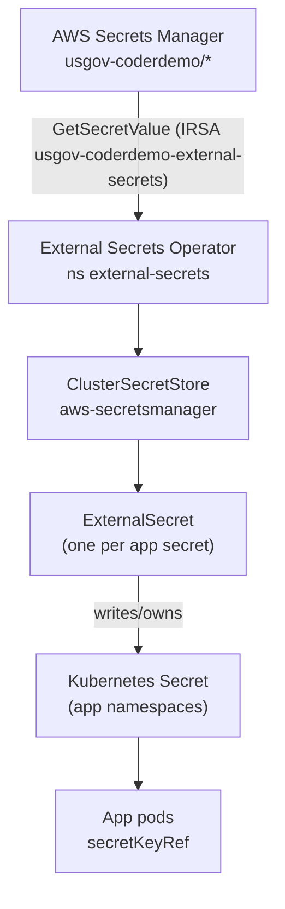

# Secrets

Runtime secrets are sourced from **AWS Secrets Manager** (ASM) and synced into
Kubernetes by the **External Secrets Operator** (ESO), which authenticates to ASM
with **IRSA** (no static AWS keys). ASM is the source of truth; no secret
material is committed to git.

Source of truth: `docs/as-built/85-secrets-management.md`,
`deploy/platform/external-secrets/`.

## Flow

## What runs where

| Piece | Detail |
|---|---|
| ESO | Helm chart `external-secrets` 2.6.0, ns `external-secrets` (controller, webhook, cert-controller). Image from ECR mirror `ghcr/external-secrets/external-secrets:v2.6.0`. |
| IRSA role | `usgov-coderdemo-external-secrets`. Policy: `secretsmanager:GetSecretValue` + `DescribeSecret` on `arn:aws-us-gov:secretsmanager:us-gov-west-1:430737322961:secret:usgov-coderdemo/*` only. |
| Store | `ClusterSecretStore/aws-secretsmanager`, region `us-gov-west-1`, `auth.jwt.serviceAccountRef` to the ESO controller SA. Status `Valid`. |
| ExternalSecrets | Each `dataFrom.extract`, `creationPolicy: Owner`, `refreshInterval: 1h`. |

## ASM secret layout

Each ASM secret is a JSON object whose keys match the target Kubernetes Secret
keys. ESO `extract` materializes them 1:1.

| ASM secret | JSON keys | Kubernetes Secret (ns/name) |
|---|---|---|
| usgov-coderdemo/coder/db | url | coder/coder-db |
| usgov-coderdemo/coder/oidc | client-secret | coder/coder-oidc |
| usgov-coderdemo/coder/ai | ANTHROPIC_API_KEY | coder/coder-ai |
| usgov-coderdemo/coder/external-auth | gitlab-client-id, gitlab-client-secret | coder/coder-external-auth |
| usgov-coderdemo/keycloak/admin | username, password | keycloak/keycloak-admin |
| usgov-coderdemo/keycloak/db | username, password | keycloak/keycloak-db |
| usgov-coderdemo/gitlab/secrets | initial_root_password, root_password | gitlab/gitlab-secrets |
| usgov-coderdemo/gitlab/oidc | client-secret | gitlab/gitlab-oidc |
| usgov-coderdemo/observability/grafana-oauth | client-secret | monitoring/grafana-oauth |
| usgov-coderdemo/observability/kiali-oauth | oidc-secret | istio-system/kiali |
| usgov-coderdemo/envdocs/oauth | client-secret, cookie-secret | envdocs/envdocs-oauth |

!!! info "This site follows the same pattern"
    The documentation site's auth gate stores its Keycloak OIDC client secret and
    the oauth2-proxy cookie secret in `usgov-coderdemo/envdocs/oauth`. The
    `envdocs-oauth` ExternalSecret syncs them into the `envdocs` namespace. The
    secret is created by `scripts/setup-envdocs.py`, mirroring
    `scripts/setup-grafana-oidc.py`. See [Access and auth gate](access-and-auth.md).

## Operational notes

- **Rotation:** update the value in ASM. ESO refreshes the Kubernetes Secret
  within `refreshInterval` (1h) or immediately if the Secret is deleted. Pods
  that read a secret as an env var only pick up a new value on restart, so roll
  the relevant Deployment after rotation.
- **Least privilege:** the ESO role can only read `usgov-coderdemo/*` and cannot
  write to ASM.
- **No secrets in git:** only `deploy/*/secrets.example.yaml` placeholders are
  committed.

## Backlog

- EKS Secrets envelope encryption with a customer-managed KMS key is defined in
  `terraform/secrets-hardening.tf` but not applied (the re-encrypt is
  irreversible and needs a maintenance decision).
