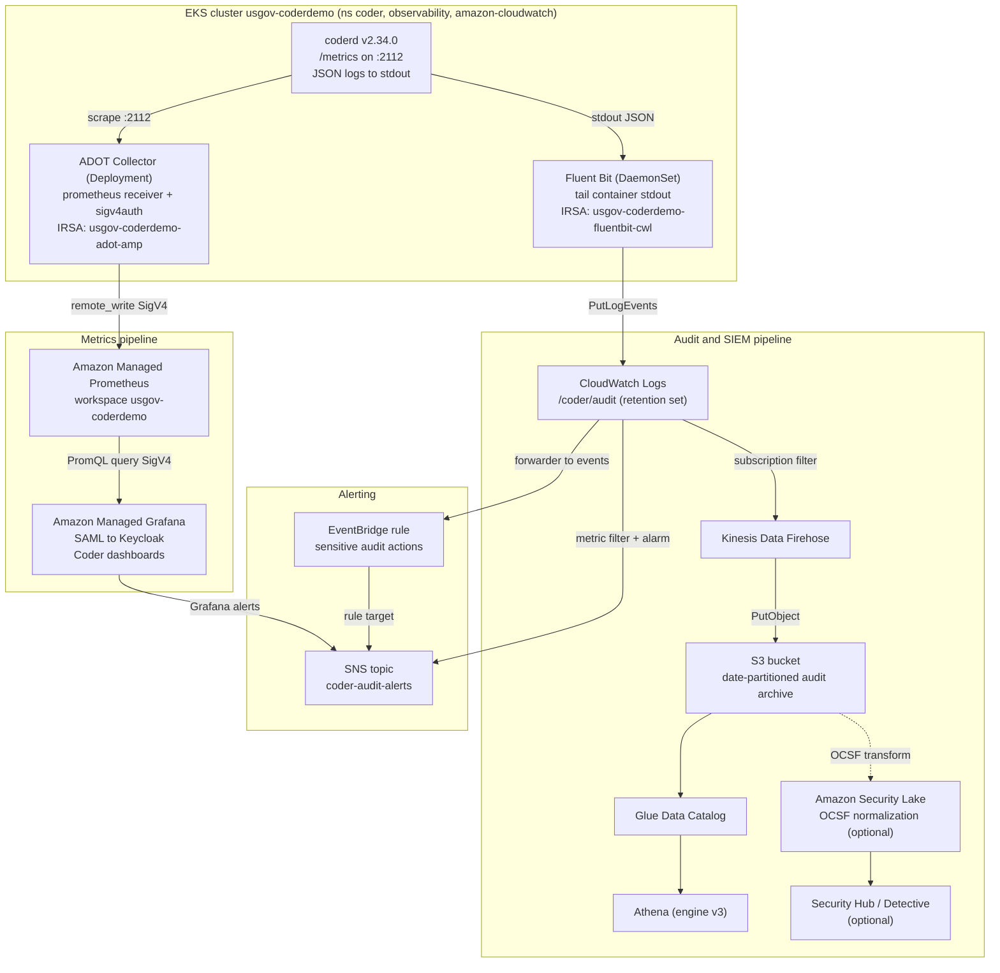

# Plan: AWS-native observability and audit pipeline (production target)

Status: PLAN (design only). No cluster, AWS, Coder, or Keycloak changes were
made to produce this document. Every AWS availability claim below is grounded in
a read-only `aws` call run on 2026-06-07 against account `430737322961`,
partition `aws-us-gov`, region `us-gov-west-1`. Items that could not be fully
verified are marked "unverified" or "to verify".

This is the production, AWS-native target that the demo's in-cluster
Prometheus plus Grafana stack (built by a separate workstream) should evolve
into. It covers two pipelines:

1. Metrics: Coder Prometheus endpoint to Amazon Managed Prometheus (AMP) to
   Amazon Managed Grafana (AMG).
2. Audit and SIEM: Coder structured JSON logs to CloudWatch Logs, then to
   Kinesis Data Firehose, S3, and Athena, with an optional Amazon Security Lake
   (OCSF) path, plus alerting on sensitive audit actions.

## 1. Context and current state

| Fact | Value | Source |
|---|---|---|
| Account / partition / region | `430737322961` / `aws-us-gov` / `us-gov-west-1` | `.substrate-outputs.json`, live `aws sts get-caller-identity` |
| EKS cluster | `usgov-coderdemo`, k8s 1.36, standard (not Auto Mode), `authenticationMode=API` | live `aws eks describe-cluster` |
| EKS OIDC provider (IRSA) | `arn:aws-us-gov:iam::430737322961:oidc-provider/oidc.eks.us-gov-west-1.amazonaws.com/id/E9DB9E591C95ECB91F44EDCF38F146F2` | `.substrate-outputs.json`, `terraform/irsa.tf` |
| OIDC issuer host | `oidc.eks.us-gov-west-1.amazonaws.com/id/E9DB9E591C95ECB91F44EDCF38F146F2` | `.substrate-outputs.json` |
| Coder | v2.34.0, ns `coder`, served at `https://dev.usgov.coderdemo.io` | `docs/as-built/30-coder-control-plane.md` |
| Coder metrics port (live) | `CODER_PROMETHEUS_ADDRESS=0.0.0.0:2112` already set on the Deployment | live `kubectl -n coder get deploy coder` |
| Coder Service ports (live) | only `http` 80 to container `8080`. Port `2112` is not in the Service or as a named containerPort. | live `kubectl -n coder get svc/deploy coder` |
| Identity | Keycloak realm `coder` at `https://auth.usgov.coderdemo.io/realms/coder`, OIDC client `coder` | `docs/as-built/40-identity-keycloak.md` |
| IRSA precedent | `usgov-coderdemo-coder-bedrock`, `usgov-coderdemo-external-secrets`, `usgov-coderdemo-ebs-csi` use the cluster OIDC provider with least-privilege inline policies | `terraform/irsa.tf`, `terraform/secrets-hardening.tf` |
| In-cluster demo stack | A separate workstream is building Prometheus plus Grafana in-cluster for the demo. Reserved host `metrics.usgov.coderdemo.io`. | `docs/AGENT-PRD.md`, `docs/decisions-locked.md` |
| Secrets pattern | AWS Secrets Manager is source of truth, synced by External Secrets Operator via IRSA | `docs/as-built/85-secrets-management.md` |

The cluster already exposes the Coder metrics address, but the metrics port is
not yet wired into a Service and `CODER_PROMETHEUS_ENABLE` is not present, so
metrics are not yet scrapeable end to end. JSON logging is not enabled.

## 2. Verified GovCloud service availability

All calls below were read-only (`list` / `describe`) under `AWS_PROFILE`
`demoenv-usgov`, region `us-gov-west-1`, CLI `aws-cli/2.34.63`.

| Service | Probe | Result | Conclusion |
|---|---|---|---|
| Amazon Managed Prometheus (AMP) | `aws amp list-workspaces` | `{"workspaces": []}` | Available. |
| AMP managed scraper (collector) | `aws amp list-scrapers` | `AccessDeniedException: Unable to determine service/operation name to be authorized` on a current CLI | The managed scraper operation is not served by the regional endpoint. Treat the AMP managed collector as NOT available in `us-gov-west-1`. Use a self-managed ADOT collector. (Verified by probe; see caveats.) |
| Amazon Managed Grafana (AMG) | `aws grafana list-workspaces` | `{"workspaces": []}` | Available. |
| IAM Identity Center | `aws sso-admin list-instances` | `{"Instances": []}` | Not enabled. Account is standalone (`organizations:DescribeOrganization` returns `AWSOrganizationsNotInUseException`). AMG SAML is the simpler auth path. |
| Amazon Security Lake | `aws securitylake list-data-lakes` | `{"dataLakes": []}` | API available, not enabled. |
| AWS Security Hub | `aws securityhub describe-hub` | `InvalidAccessException: not subscribed` | API available, not enabled. |
| Amazon Detective | `aws detective list-graphs` | `{"GraphList": []}` | API available, not enabled. |
| Kinesis Data Firehose | `aws firehose list-delivery-streams` | empty list | Available. |
| Amazon Athena | `aws athena list-work-groups` | `primary` workgroup, engine v3 | Available. |
| AWS Glue | `aws glue get-databases` | `{"DatabaseList": []}` | Available. |
| Amazon EventBridge | `aws events list-event-buses` | `default` bus present | Available. |
| Amazon SNS | `aws sns list-topics` | empty list | Available. |
| CloudWatch Logs | `aws logs describe-log-groups` | existing groups present | Available. |
| AWS KMS | `aws kms list-aliases` | AWS-managed aliases present, no CMKs yet | Available. |
| EKS addon `adot` | `aws eks describe-addon-versions --addon-name adot` | `v0.151.0-eksbuild.1` (and older) | ADOT EKS managed addon available. |
| EKS addon `amazon-cloudwatch-observability` | `describe-addon-versions` | `v6.2.0-eksbuild.1` | CloudWatch agent plus Fluent Bit addon available. |
| EKS addon `eks-pod-identity-agent` | `describe-addon-versions` | `v1.3.10-eksbuild.3`, compatible with 1.36 | EKS Pod Identity available as an alternative to IRSA. |

To verify before build (not provable read-only without creating resources):

- AMP remote write hostname for GovCloud. The standard pattern is
  `https://aps-workspaces.us-gov-west-1.amazonaws.com/workspaces/<ws-id>/api/v1/remote_write`.
  Confirm whether a FIPS endpoint
  (`aps-workspaces-fips.us-gov-west-1.amazonaws.com`) is required by the
  compliance posture.
- AMG SAML federation against Keycloak (assertion attributes, role mapping).
- Security Lake OCSF custom-source registration and the Coder-to-OCSF mapping.

## 3. Target architecture



## 4. Component table

| # | Component | AWS service / object | Auth | Runs where | Notes |
|---|---|---|---|---|---|
| M1 | Coder metrics endpoint | n/a (coderd) | n/a | ns `coder` | `:2112/metrics`; enable plus expose via Service. |
| M2 | Metrics scraper | ADOT Collector (self-managed Deployment, or the `adot` EKS addon) | IRSA `usgov-coderdemo-adot-amp` | ns `observability` | Prometheus receiver scrapes `:2112`; `prometheusremotewrite` exporter with `sigv4auth`. Managed AMP scraper is unavailable in this region. |
| M3 | Metrics store | Amazon Managed Prometheus workspace | SigV4 | AWS managed | Receives `remote_write`; 150-day default retention. |
| M4 | Dashboards | Amazon Managed Grafana workspace | SAML to Keycloak; AMP data source via AMG service role | AWS managed | Import Coder's published Grafana dashboards. |
| A1 | Log emitter | coderd JSON logs to stdout | n/a | ns `coder` | `CODER_LOGGING_JSON=/dev/stderr`; audit events are in coderd logs. |
| A2 | Log shipper | Fluent Bit DaemonSet (or `amazon-cloudwatch-observability` addon) | IRSA `usgov-coderdemo-fluentbit-cwl` | ns `amazon-cloudwatch` | Tails coder pod stdout to CloudWatch Logs group `/coder/audit`. |
| A3 | Log store and retention | CloudWatch Logs group `/coder/audit` | IAM | AWS managed | Set retention via `logs:PutRetentionPolicy`. |
| A4 | Stream to lake | Kinesis Data Firehose | Firehose service role | AWS managed | Source: CloudWatch Logs subscription filter. |
| A5 | Archive | S3 bucket (date-partitioned) | IAM, SSE-KMS | AWS managed | `year=/month=/day=/` prefixing for Athena. |
| A6 | Catalog and query | Glue Data Catalog plus Athena | IAM | AWS managed | Glue table or crawler over the S3 prefix. |
| A7 | OCSF SIEM (optional) | Amazon Security Lake plus Security Hub plus Detective | IAM | AWS managed | Coder custom source, OCSF mapping; compliance-grade path. |
| AL1 | Alert detection | CloudWatch Logs metric filter plus alarm, and/or EventBridge rule | IAM | AWS managed | Sensitive actions (license, user role change, template push, login failures). |
| AL2 | Notification | SNS topic `coder-audit-alerts` | IAM | AWS managed | Email/Slack/PagerDuty subscribers; also AMG alerts. |

## 5. Metrics pipeline detail

### 5.1 Coder metrics

Coder exposes Prometheus metrics when `CODER_PROMETHEUS_ENABLE=true`. The live
Deployment already sets `CODER_PROMETHEUS_ADDRESS=0.0.0.0:2112` but does not set
`CODER_PROMETHEUS_ENABLE`, and `:2112` is not exposed by the `coder` Service.
Required Coder config (see section 8). The scraper reaches metrics over the pod
network at `:2112`; a dedicated headless Service or a Prometheus
annotation/PodMonitor selects the pod.

### 5.2 Scraper: self-managed ADOT collector with SigV4

The AMP managed collector (`aws amp list-scrapers`) is not available in
`us-gov-west-1` (verified by probe), so run the AWS Distro for OpenTelemetry
(ADOT) collector in-cluster. Two deployment options:

- The `adot` EKS managed addon (`v0.151.0-eksbuild.1` available), or
- A self-managed ADOT Collector Deployment from the ECR mirror (consistent with
  the no-pull-through-cache constraint in `docs/as-built/10-infrastructure.md`).

Collector config outline (concept, not applied):

```yaml
receivers:
  prometheus:
    config:
      scrape_configs:
        - job_name: coderd
          kubernetes_sd_configs: [{ role: pod }]
          relabel_configs:
            - source_labels: [__meta_kubernetes_namespace]
              regex: coder
              action: keep
            - source_labels: [__meta_kubernetes_pod_container_port_number]
              regex: "2112"
              action: keep
extensions:
  sigv4auth:
    region: us-gov-west-1
    service: aps
exporters:
  prometheusremotewrite:
    endpoint: https://aps-workspaces.us-gov-west-1.amazonaws.com/workspaces/<AMP_WS_ID>/api/v1/remote_write
    auth: { authenticator: sigv4auth }
service:
  extensions: [sigv4auth]
  pipelines:
    metrics:
      receivers: [prometheus]
      exporters: [prometheusremotewrite]
```

The `sigv4auth` extension signs `remote_write` with the IRSA-provided role
credentials. No static AWS keys, matching the Bedrock and ESO precedent.

### 5.3 AMP workspace

Create one AMP workspace (alias `usgov-coderdemo`). Encrypt with a CMK if the
posture requires it (KMS is available; no CMK exists yet). Default retention is
150 days; adjust to the compliance requirement.

### 5.4 Amazon Managed Grafana and auth

AMG requires either IAM Identity Center or SAML for user auth. IAM Identity
Center has no instances and the account is not in an Organization (both
verified), so enabling Identity Center is extra scope. Recommended:

- User auth: SAML federation directly to Keycloak (realm `coder`), reusing the
  existing IdP and persona/group model in
  `docs/as-built/45-idp-sync-personas.md`. Map a Keycloak group to the AMG Admin
  role and another to Viewer/Editor.
- Data source auth: the AMG workspace IAM role (service-managed) granted
  read-only AMP query permissions (and CloudWatch read for the optional
  CloudWatch data source).

Dashboards: import Coder's published Grafana dashboards (the coderd and
workspace dashboards from the coder/coder monitoring docs; confirm exact source
and version at build time). Add the AMP workspace as the Prometheus data source
with SigV4 enabled.

## 6. Audit and SIEM pipeline detail

### 6.1 Why JSON logs carry audit data

Coder's audit log is stored in the database and surfaced through the API and UI.
It is also emitted to the coderd process logs: Coder documents that server
errors, audit logs, user activities, and SSO/OIDC events are all captured in the
coderd logs. Enabling JSON logging therefore turns coderd stdout into a
machine-parsable audit stream that Fluent Bit can ship. This is the integration
seam for the SIEM. (The Coder audit API is an alternative pull-based source, but
the stdout-plus-Fluent-Bit path matches the EKS-native pattern requested.)

### 6.2 Fluent Bit to CloudWatch Logs

Run Fluent Bit as a DaemonSet (or use the `amazon-cloudwatch-observability`
addon, `v6.2.0` available). Tail the `coder` namespace container stdout, filter
to audit-bearing records, and write to CloudWatch Logs group `/coder/audit`.
Authenticate with IRSA role `usgov-coderdemo-fluentbit-cwl`. Set group retention
explicitly with `logs:PutRetentionPolicy` (for example 365 days; choose per
policy). Encrypt the group with a CMK if required.

### 6.3 Firehose to S3, Glue, Athena

A CloudWatch Logs subscription filter on `/coder/audit` streams to a Kinesis
Data Firehose delivery stream, which writes to an S3 bucket with date
partitioning (`s3://usgov-coderdemo-audit/coder/audit/year=YYYY/month=MM/day=DD/`).
Use Firehose dynamic partitioning and, optionally, Parquet conversion for cheaper
Athena scans. Catalog the prefix with a Glue table (or crawler) and query in
Athena (engine v3 available). Apply an S3 lifecycle policy for cold storage
(Glacier transition) and expiration aligned to the retention requirement; this S3
archive, not the Coder database, is the long-term system of record.

### 6.4 Optional: Amazon Security Lake (OCSF)

For a compliance-grade SIEM, register Coder as a Security Lake custom source and
normalize audit events to OCSF (for example Authentication, Account Change, and
API Activity classes) using a Glue or Lambda transform. Security Lake then
manages the partitioned OCSF S3 store and exposes it to subscribers (Athena,
Security Hub, Detective). Caveats: Security Hub is not subscribed and Detective
has no graph yet (both verified); both must be enabled, and the Coder-to-OCSF
field mapping must be authored and maintained.

### 6.5 Alerting on sensitive audit actions

Sensitive actions to alert on include: license add/remove, user role or
organization-membership change, template create/push, external-auth or OIDC
config change, owner login, and repeated login failures.

- Simplest path: CloudWatch Logs metric filters on `/coder/audit` patterns, with
  CloudWatch Alarms that publish to SNS topic `coder-audit-alerts`.
- Richer routing: a CloudWatch Logs subscription filter to a small Lambda that
  emits structured events to EventBridge; EventBridge rules then match action
  types and target SNS (and other targets). EventBridge does not read CloudWatch
  Logs content directly, so a forwarder is required.
- Dashboards-side: AMG Grafana alerts on metric thresholds (for example error
  rate, provisioner failures) to the same SNS topic.

## 7. IAM and IRSA requirements (least privilege)

All roles trust the existing cluster OIDC provider
(`arn:aws-us-gov:iam::430737322961:oidc-provider/oidc.eks.us-gov-west-1.amazonaws.com/id/E9DB9E591C95ECB91F44EDCF38F146F2`)
with `aud = sts.amazonaws.com` and a `sub` pinned to the exact service account,
exactly like `terraform/irsa.tf`. EKS Pod Identity is an available alternative
(addon present) if the team prefers it over IRSA.

### 7.1 ADOT scraper role `usgov-coderdemo-adot-amp`

- Trust `sub = system:serviceaccount:observability:adot-collector`.
- Policy: `aps:RemoteWrite` on
  `arn:aws-us-gov:aps:us-gov-west-1:430737322961:workspace/<AMP_WS_ID>`.

### 7.2 Fluent Bit role `usgov-coderdemo-fluentbit-cwl`

- Trust `sub = system:serviceaccount:amazon-cloudwatch:fluent-bit`.
- Policy: `logs:CreateLogStream`, `logs:PutLogEvents`,
  `logs:DescribeLogStreams`, `logs:PutRetentionPolicy`, and
  `logs:CreateLogGroup` (scoped to
  `arn:aws-us-gov:logs:us-gov-west-1:430737322961:log-group:/coder/audit:*`).

### 7.3 Firehose service role `usgov-coderdemo-firehose-audit`

- Trust principal `firehose.amazonaws.com`.
- Policy: `s3:PutObject`/`s3:GetBucketLocation`/`s3:ListBucket` on the audit
  bucket and prefix; `kms:GenerateDataKey`/`kms:Decrypt` on the bucket CMK;
  `logs:PutLogEvents` to the Firehose error log group; Glue read if format
  conversion is enabled.

### 7.4 CloudWatch Logs to Firehose role `usgov-coderdemo-cwl-to-firehose`

- Trust principal `logs.us-gov-west-1.amazonaws.com`.
- Policy: `firehose:PutRecord`, `firehose:PutRecordBatch` on the delivery stream.

### 7.5 AMG workspace IAM role (data sources)

- Used by the AMG workspace to query data.
- Policy: `aps:QueryMetrics`, `aps:GetLabels`, `aps:GetSeries`,
  `aps:GetMetricMetadata`, `aps:ListWorkspaces` on the AMP workspace; optional
  CloudWatch read (`cloudwatch:GetMetricData`, `logs:StartQuery`,
  `logs:GetQueryResults`) for the CloudWatch data source.

### 7.6 EventBridge to SNS and Security Lake roles (optional)

- EventBridge target permission via an SNS topic resource policy allowing
  `events.amazonaws.com` to `sns:Publish`, or an EventBridge role.
- Security Lake custom-source role and the transform (Glue/Lambda) execution
  role if the OCSF path is adopted.

## 8. Coder configuration required

Add to `deploy/coder/values.yaml` `coder.env` (declarative; apply via Helm).
Note `CODER_LOG_FORMAT` is not a current Coder key; the real keys are
`CODER_LOGGING_HUMAN` and `CODER_LOGGING_JSON`.

```yaml
# Metrics
- name: CODER_PROMETHEUS_ENABLE
  value: "true"
- name: CODER_PROMETHEUS_ADDRESS
  value: "0.0.0.0:2112"        # already live
- name: CODER_PROMETHEUS_COLLECT_AGENT_STATS
  value: "true"
- name: CODER_PROMETHEUS_COLLECT_DB_METRICS
  value: "false"               # enable deliberately; can be high-cardinality
# Structured logging for SIEM (audit events are in coderd logs)
- name: CODER_LOGGING_JSON
  value: "/dev/stderr"
- name: CODER_LOGGING_HUMAN
  value: "/dev/null"           # avoid duplicate human-format lines
```

Also expose the metrics port so the scraper can reach it. Either add `2112` as a
named container port plus a small headless Service, or select the pod with a
PodMonitor / Prometheus pod annotations. Keep `:2112` cluster-internal; do not
route it through the ingress NLB.

Retention notes:

- Coder has no built-in audit-log TTL; the `audit_log` table grows unbounded in
  RDS. Treat S3 (with a lifecycle policy) and the CloudWatch Logs retention
  setting as the retention controls for the SIEM, and track RDS audit-table
  growth as a separate day-2 item.
- The `connection_log` and `audit_log` premium features are already entitled and
  enabled (`docs/as-built/30-coder-control-plane.md`).

## 9. GovCloud caveats (consolidated)

- AMP managed collector (scraper) is not available in `us-gov-west-1` (verified
  by probe). Use a self-managed ADOT collector with SigV4. This is the single
  biggest divergence from a typical commercial-region design.
- AMG auth needs IAM Identity Center or SAML. Identity Center is not enabled and
  the account is standalone (verified). SAML to Keycloak is recommended; turning
  on Identity Center is optional extra scope.
- Security Hub is not subscribed and Detective has no graph (verified). The
  Security Lake / Security Hub / Detective path requires enabling these first and
  authoring the OCSF mapping.
- Confirm whether FIPS endpoints are mandated. AMP, Firehose, and CloudWatch
  Logs publish FIPS endpoints in GovCloud; the ADOT `sigv4auth` endpoint and
  Firehose destination may need the `-fips` hostnames.
- No ECR pull-through cache in GovCloud. ADOT, Fluent Bit, and any collector
  images must be mirrored into ECR per `scripts/mirror-images.sh`
  (`docs/as-built/10-infrastructure.md`).
- Coder's egress to public Anthropic already uses the single NAT gateway; the
  observability pipeline should prefer VPC endpoints (interface endpoints for
  AMP, CloudWatch Logs, Firehose, STS, S3 gateway) to keep telemetry traffic in
  the boundary and off the NAT path. Verify endpoint availability per service in
  `us-gov-west-1`.

## 10. Migration path from the in-cluster demo stack

The separate workstream is standing up in-cluster Prometheus plus Grafana for
the demo. Evolve, do not rebuild:

Keep:

- The Coder metrics configuration (section 8) and the metric set.
- Grafana dashboards and alert rules. Re-import the same dashboard JSON into AMG;
  port Alertmanager rules to AMG alerts or to CloudWatch alarms.
- The scrape selection logic (PodMonitor/labels) can be reused by the ADOT
  prometheus receiver.

Replace:

- In-cluster Prometheus server to AMP. As a low-risk bridge, configure the
  existing in-cluster Prometheus `remote_write` to AMP (dual-run) before cutting
  the scraper over to a standalone ADOT collector, then retire the in-cluster
  Prometheus.
- In-cluster Grafana to AMG (SAML to Keycloak).
- In-cluster Alertmanager to AMG alerts plus SNS.

Sequence: enable Coder config first (works for both stacks), add AMP and
`remote_write` from the existing Prometheus, stand up AMG against AMP, validate
dashboards, then remove the in-cluster Prometheus/Grafana/Alertmanager.

## 11. Phased rollout

| Phase | Scope | Risk | Depends on |
|---|---|---|---|
| 0 | Coder config: enable Prometheus, expose `:2112`, JSON logging, retention plan | Low (Helm rev) | none |
| 1 | AMP workspace plus ADOT collector (IRSA, SigV4 remote_write); verify series in AMP | Medium | Phase 0 |
| 2 | AMG workspace, SAML to Keycloak, AMP data source, import Coder dashboards | Medium | Phase 1 |
| 3 | Fluent Bit DaemonSet to CloudWatch Logs `/coder/audit` (IRSA), set retention | Low/Medium | Phase 0 |
| 4 | Firehose to S3 (date-partitioned) plus Glue plus Athena | Medium | Phase 3 |
| 5 | Alerting: CloudWatch metric filters / EventBridge to SNS, plus AMG alerts | Low | Phases 2 and 3 |
| 6 | Optional: Security Lake OCSF custom source plus Security Hub/Detective | High | Phase 4 |
| 7 | Decommission in-cluster demo stack; reconcile all IAM/IRSA into Terraform | Medium | Phases 2 and 4 |

## 12. Open questions and to-verify

- AMP and Firehose FIPS endpoint requirement for this boundary.
- Exact source and version of Coder's published Grafana dashboards to import.
- Retention numbers (CloudWatch Logs days, S3 lifecycle, AMP days) per the
  compliance requirement.
- Whether to standardize on IRSA or EKS Pod Identity for new workloads (both
  available); this plan uses IRSA to match existing precedent.
- CMK strategy (per-service CMKs vs a shared observability CMK) for AMP, the S3
  audit bucket, and the CloudWatch Logs group.

## Appendix: verification commands (read-only, 2026-06-07)

```
aws sts get-caller-identity
aws amp list-workspaces --region us-gov-west-1
aws amp list-scrapers --region us-gov-west-1            # AccessDenied: unsupported op
aws grafana list-workspaces --region us-gov-west-1
aws sso-admin list-instances --region us-gov-west-1     # []
aws organizations describe-organization                 # not in an org
aws securitylake list-data-lakes --region us-gov-west-1
aws securityhub describe-hub --region us-gov-west-1      # not subscribed
aws detective list-graphs --region us-gov-west-1
aws firehose list-delivery-streams --region us-gov-west-1
aws athena list-work-groups --region us-gov-west-1
aws glue get-databases --region us-gov-west-1
aws events list-event-buses --region us-gov-west-1
aws sns list-topics --region us-gov-west-1
aws logs describe-log-groups --region us-gov-west-1
aws kms list-aliases --region us-gov-west-1
aws eks describe-cluster --name usgov-coderdemo --region us-gov-west-1
aws eks describe-addon-versions --addon-name adot --region us-gov-west-1
aws eks describe-addon-versions --addon-name amazon-cloudwatch-observability --region us-gov-west-1
aws eks describe-addon-versions --addon-name eks-pod-identity-agent --region us-gov-west-1
```

Generated by Coder Agents.
